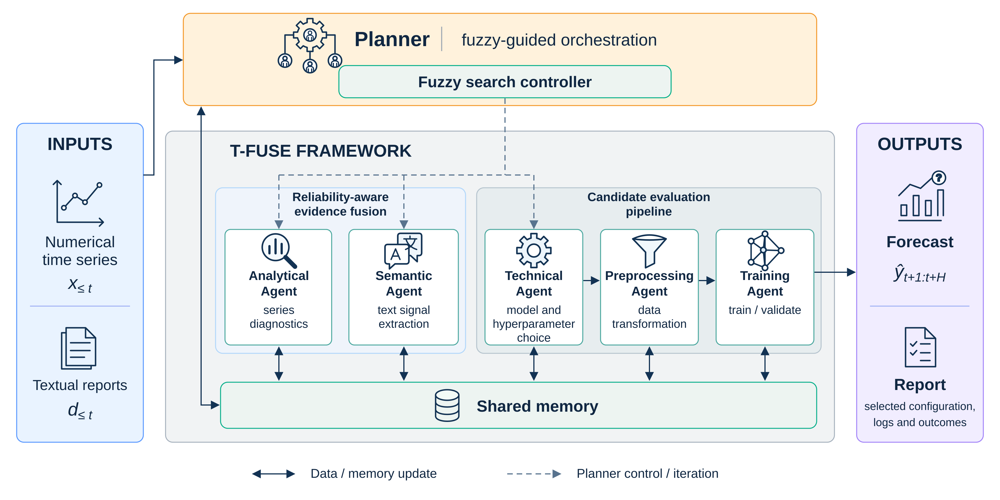

# T-FUSE: Fuzzy-Guided Temporal Fusion of Semantic Evidence and Numerical Signals for Time-Series Forecasting

## Abstract
Agentic AI systems require decision mechanisms capable of operating under heterogeneous, uncertain, and potentially conflicting information. This challenge is particularly relevant to time-series forecasting, where numerical diagnostics, textual knowledge, technical constraints, and empirical validation provide complementary evidence with different levels of reliability. The resulting problem is to regulate how these sources influence successive forecasting decisions according to their reliability as validation feedback is progressively obtained within a finite search budget. To address this problem, we propose \textbf{T-FUSE}, a fuzzy-guided agentic framework for text-augmented time-series forecasting in which soft computing is explicitly incorporated at the orchestration level. The framework relies on two complementary fuzzy mechanisms. The first performs reliability-aware evidence fusion by assessing the quality and consistency of semantic information and combining it with analytical evidence to derive graded compatibility values over forecasting model families. The second implements fuzzy adaptive search control by integrating these compatibilities with the evolving empirical search state to regulate exploration, refinement, and termination throughout the forecasting configuration search. The resulting fuzzy outputs provide graded and revisable guidance, while final model selection remains exclusively determined by empirical validation performance. T-FUSE is evaluated across forecasting tasks spanning heterogeneous application domains, temporal resolutions, and prediction horizons. Experimental results support the effectiveness of the proposed formulation across the considered settings, while ablation, sensitivity, and case-study analyses further characterize the contribution and behavior of the fuzzy-guided decision process. Overall, the results support fuzzy inference as an interpretable soft-computing decision layer for uncertainty-aware agentic analytical workflows.



## Installation

```bash
conda env create -f environment.yml
conda activate tfuse
```

The default local LLM is `Qwen/Qwen3.6-27B`. If its Hugging Face snapshot is
not already cached, the runtime downloads it automatically on the first run
and uses the local snapshot afterwards. The initial download requires network
access and sufficient disk space. To pre-download it manually:

```bash
hf download Qwen/Qwen3.6-27B
```

## Run an experiment

```bash
python main.py \
  --dataset data/Energy/US_GasolinePrice_Week.csv \
  --horizon 4 \
  --split 0.70 0.20 0.10
```

- `--dataset` is the input dataset. 
- `--horizon` is the positive number of future steps predicted by each model
  forecast operation.
- `--split TRAIN VALIDATION TEST` defines contiguous chronological partitions.
  

Optional operational flags are `--run-id`,  and `--output-root`.


## Runtime outputs

Each run is isolated below `outputs/runs/<run-id>/final/` (or the supplied
`--output-root`) and contains `final_results.json`,
`performance_history.json`, `search_trace.json`, and `predictions.json`.
